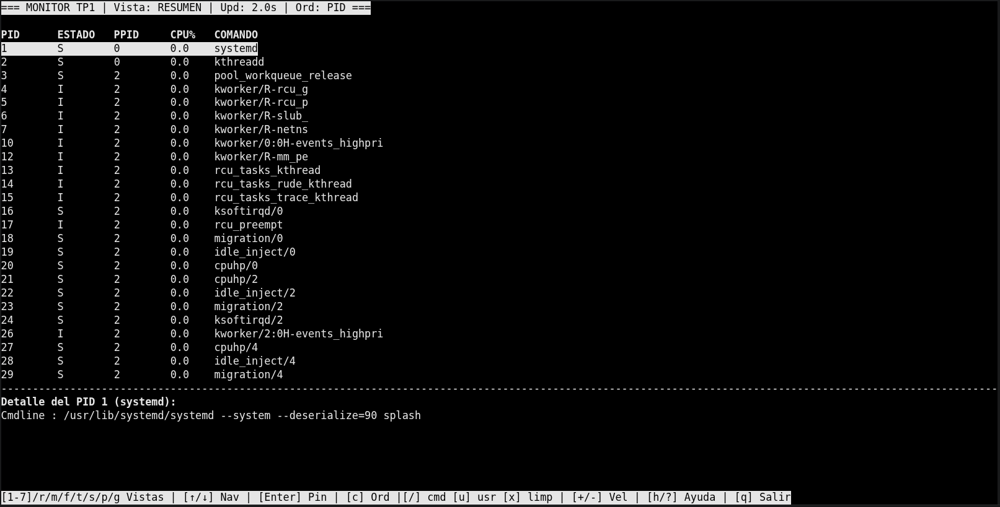
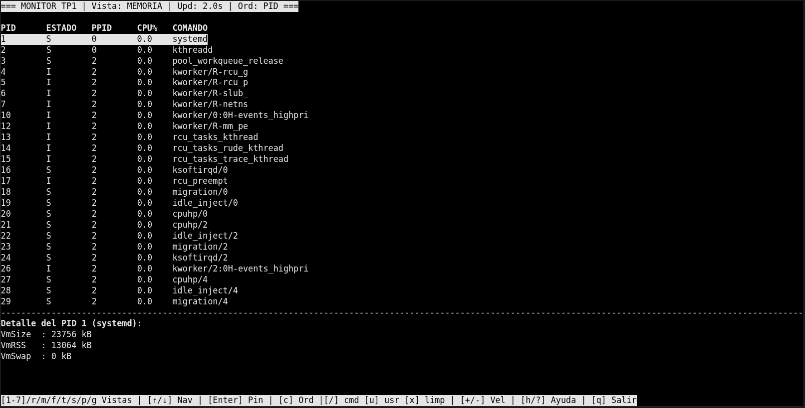
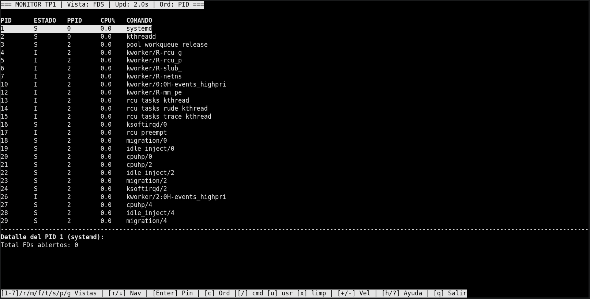
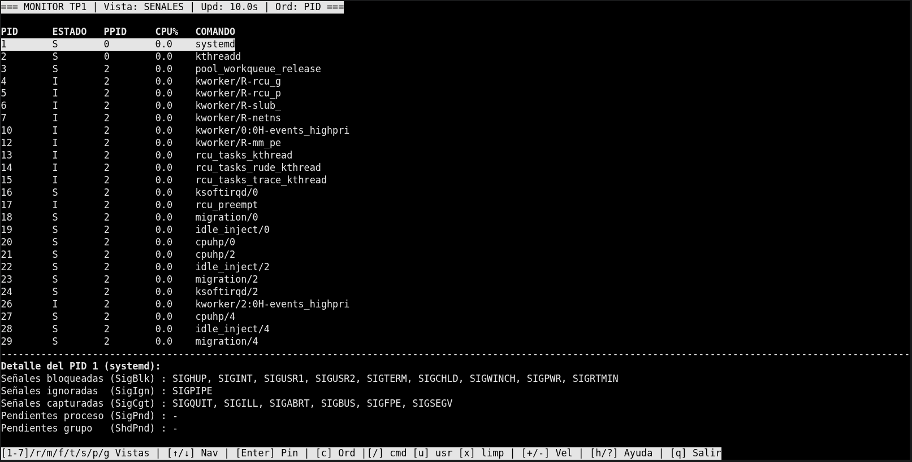
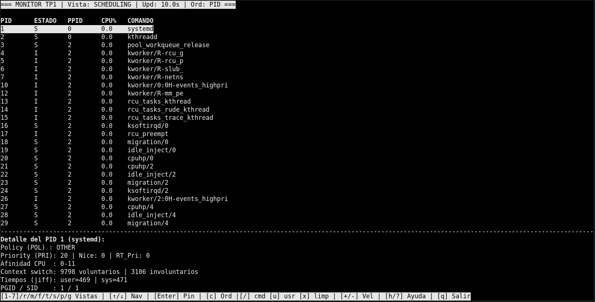
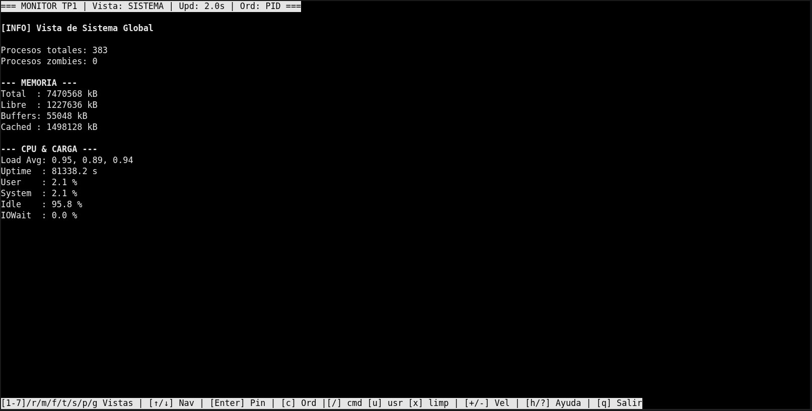
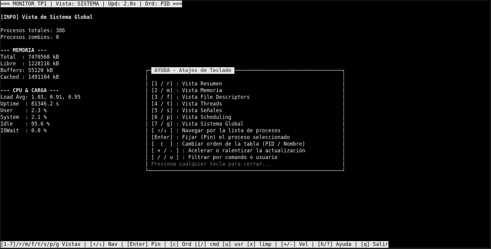
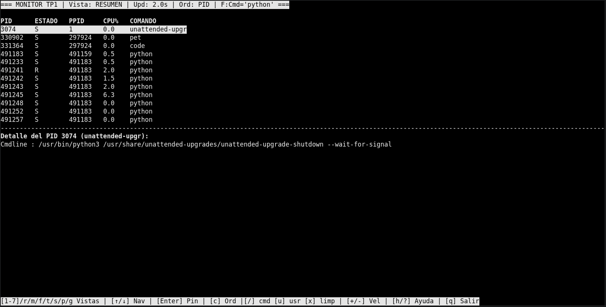

## Descripción general

Este proyecto implementa un monitor de sistema en Python para Linux que extrae información de procesos y recursos directamente desde el pseudo-sistema de archivos `/proc`, procesándola de manera concurrente y presentándola a través de una interfaz interactiva de terminal (TUI).

La aplicación se encarga de:
- Recolectar *snapshots* periódicos del estado global del equipo y de los procesos en ejecución.
- Analizar de forma independiente diferentes vistas especializadas (resumen de procesos, consumo de memoria, descriptores de archivos, hilos, señales, scheduling y métricas globales del sistema).
- Proveer una interfaz interactiva basada en `curses` con opciones de navegación, ordenamiento dinámico, filtros por comando o usuario y fijado de procesos (*pinning*).
- Gestionar señales del sistema operativo (como `SIGUSR1` para volcados automáticos a JSON o `SIGINT`/`SIGTERM` para un cierre limpio) de manera segura.
- Sincronizar el estado entre procesos utilizando estructuras de `multiprocessing.Manager`.

## Estructura del proyecto

```text
TP1/
├── config.json
├── Dockerfile
├── docker-compose.yml
├── requirements.txt
├── README.md
└── src/
    ├── main.py
    ├── config.py
    ├── display.py
    ├── procfs.py
    ├── recolector.py
    ├── shared.py
    ├── senales.py
    └── analizadores/
        ├── __init__.py
        ├── fds.py
        ├── memoria.py
        ├── resumen.py
        ├── scheduling.py
        ├── senales.py
        ├── sistema.py
        └── threads.py
```
## Archivos principales

- **`src/main.py`**: Punto de entrada de la aplicación. Arranca los procesos del recolector y los analizadores, y lanza la interfaz de usuario.
- **`src/config.py`**: Carga la configuración de intervalos desde el archivo `config.json`.
- **`src/procfs.py`**: Lee los datos directamente desde `/proc` para procesos, memoria, CPU, fds, hilos y mapas de memoria.
- **`src/recolector.py`**: Se encarga de construir el *snapshot* global del sistema y de los procesos activos.
- **`src/shared.py`**: Define el estado compartido entre procesos utilizando un `Manager().dict()`.
- **`src/senales.py`**: Gestiona las señales del sistema operativo y los mecanismos de notificación.
- **`src/display.py`**: Renderiza la TUI mediante `curses`, procesa las pulsaciones de teclas y muestra las diferentes vistas.
- **`src/analizadores/`**: Contiene la lógica específica para cada una de las vistas del monitor (resumen, memoria, fds, threads, señales, scheduling y sistema).

## Diagrama de arquitectura

Proceso y comunicación:

```text
                     +----------------+
                     |    usuario     |
                     +--------+-------+
                              |
                              v
                    +----------------------+        signals
                    |      `src/main.py`   |<--------------------+
                    +---------+------------+                     |
                              | spawn processes                  |
      +-----------------------+-----------------------+          |
      |                       |                       |          |
      v                       v                       v          |
 +-----------+    +----------------------+   +----------------+  |
 | recolector|--->| shared `Manager().dict`|<--| display (curses)|  |
 | src/recolector.py | (snapshot, intervalos)|   | src/display.py |  |
 +-----------+    +----------------------+   +----------------+  |
      |                       ^                       ^          |
      |                       |                       |          |
      |                       |                       |          |
      v                       |                       |          |
 +-----------+  +-----------+ |  +-------------+  +---+----+     |
 |analizador |  |analizador | |  |analizador   |  |analizador|    |
 | sistema   |  | resumen   | |  | memoria     |  | fds      |    |
 | src/...   |  | src/...   | |  | src/...     |  | src/...  |    |
 +-----------+  +-----------+ |  +-------------+  +---------+    |
                              |                                    |
                              +------------------------------------+
```

## Decisiones de diseño (argumentadas)

- **Mecanismo de IPC elegido**
  - Se utiliza `multiprocessing.Manager().dict()` como la estructura compartida principal (`snapshot`) entre el recolector, los analizadores y la interfaz de usuario. Esto permite mantener un snapshot global complejo con diccionarios anidados y listas sin necesidad de serializar manualmente objetos en cada pasaje.
  - La comunicación fluye de manera ordenada, donde el agregador es el único que vuelca los resultados finales al snapshot, evitando conflictos directos.

- **¿Por qué `Manager` y no `Value` / `Array` para el snapshot?**
  - `Value` y `Array` son útiles para datos simples y homogéneos. El snapshot global maneja estructuras heterogéneas: diccionarios anidados, listas de procesos, strings y números. Un `Manager.dict()` puede exponer esos datos directamente como proxies compartidos.
  - Para los intervalos de actualización se utiliza `multiprocessing.Value` porque son valores numéricos simples y cambiarlos es frecuente, reduciendo el overhead frente a un proxy de Manager.

- **Manejo de condiciones de carrera**
  - El recolector construye el snapshot completo localmente y luego lo publica en el `Manager.dict()` de un solo golpe.
  - No se muta el snapshot compartido *in situ*; los analizadores leen los datos enviados, generan resultados locales y luego se vuelcan en la estructura global. Esto evita inconsistencias causadas por accesos concurrentes a la misma clave.

- **Elección de intervalos por defecto**
  - Los intervalos configurados en `config.json` son moderados (2 a 10 segundos) para balancear la frescura de la información y el coste de entrada/salida (I/O) al leer continuamente `/proc`. 
  - El usuario puede ajustar el intervalo de la vista activa dinámicamente con `+` y `-` desde la interfaz, aplicándose directamente a la variable compartida.

- **Por qué `curses` y no bibliotecas externas como `rich`**
  - `curses` es parte de la biblioteca estándar de Python en Linux, por lo que no agrega dependencias externas que puedan romperse o faltar dentro del contenedor Docker.
  - Era necesaria la lectura de teclado no bloqueante (`stdscr.nodelay(True)`) para que el mismo loop pudiera redibujar la pantalla, revisar las flags de señales y leer teclas, todo sin necesidad de usar hilos (`threads`) extra para la entrada del usuario.

## Conceptos del curso aplicados

- **Detección de procesos Zombie (Clase 4: procesos, fork, exec, wait)**
  - **Aplicación en el código:** Para detectar zombies en las vistas, analizo el campo `State` leyendo directamente desde `/proc/<pid>/stat`. Este concepto se vio en clase cuando aprendimos que un proceso en estado `Z` (Zombie) es aquel que ya terminó su ejecución, pero cuyo proceso padre todavía no llamó a `wait()` para limpiar su entrada en la tabla de procesos del sistema.

- **Sistemas de archivos y el pseudo-filesystem `/proc` (Clase 2 y 3)**
  - **Aplicación en el código:** Todo el módulo `src/procfs.py` se fundamenta en este concepto. En lugar de usar herramientas externas, el monitor parsea archivos como `/proc/<pid>/status`, `/proc/meminfo` y `/proc/<pid>/fd/`. Esto refleja la teoría vista sobre cómo el kernel de Linux expone las estructuras de datos internas de los procesos y el hardware simulando archivos de texto convencionales.

- **Manejo de Señales (Clase 5: señales)**
  - **Aplicación en el código:** En el archivo `src/main.py`, utilizo la biblioteca `signal` para registrar *handlers* que atrapan señales como `SIGINT`, `SIGTERM`, `SIGUSR1` y `SIGUSR2`. Esto aplica directamente lo aprendido sobre comunicación asíncrona, permitiendo que el programa reaccione a eventos del sistema operativo (como hacer un volcado de memoria a JSON) o libere la terminal limpiamente al cerrarse.

- **Multiprocesamiento y Memoria Compartida (Clase 7: multiprocessing)**
  - **Aplicación en el código:** La orquestación en `src/main.py` levanta múltiples subprocesos independientes (`multiprocessing.Process`) para los analizadores. Para que compartan los datos recolectados hacia la interfaz sin corromper la memoria, utilizo `multiprocessing.Manager().dict()`. Esto materializa los conceptos de concurrencia, paralelismo y mecanismos de IPC (Inter-Process Communication).

## Limitaciones conocidas (Edge Cases)

- **Procesos efímeros (Race conditions de lectura):** Como la lectura se hace en espacio de usuario, si un proceso nace y muere muy rápido, el directorio `/proc/<pid>` puede desaparecer en el exacto milisegundo en que un analizador intenta abrir sus archivos internos (como `stat` o `cmdline`). Esto genera excepciones `FileNotFoundError` o `ProcessLookupError` que el código atrapa de forma defensiva para no romperse, pero significa que esos procesos ultra-cortos pueden no llegar a reflejarse en la pantalla.
- **Permisos de acceso:** Si el monitor se ejecuta con un usuario estándar (sin permisos de `root`), el sistema operativo restringe el acceso a ciertas carpetas, como `/proc/<pid>/fd/` (file descriptors) de procesos que pertenecen a otros usuarios. En estos casos, el programa no falla, pero muestra guiones (`-`) o listas vacías en esos campos.
- **Precisión del uso de CPU:** El porcentaje de uso de CPU se aproxima calculando la diferencia de *ticks* (*utime* + *stime*) en base al *uptime* general del sistema entre dos pasadas. Para intervalos muy agresivos (ej. 0.5 segundos), el cálculo puede tener leves variaciones de precisión comparado con herramientas nativas en C como `htop`.
- **Dimensiones de la terminal:** La interfaz TUI desarrollada con `curses` requiere un tamaño de terminal razonable (idealmente 80 columnas de ancho como mínimo). Si la ventana es demasiado estrecha, algunas columnas de las tablas pueden cortarse o no mostrarse por completo para evitar que la interfaz colapse.

## Cómo correr y testear

### Requisitos previos
- Entorno Linux (necesario por la dependencia de `/proc` y señales POSIX).
- Docker y Docker Compose instalados (recomendado).
- Python 3.11 o superior (si se desea correr localmente sin Docker).

### Ejecución con Docker (Recomendado)
Para evitar problemas de dependencias o versiones, la forma más limpia de correr el monitor es utilizando el contenedor preparado:

1. Ubicate en la raíz del proyecto (`TP1`).
2. Levantá el monitor con Docker Compose:
   ```bash
   docker compose run --rm monitor

### Ejecución local (Sin Docker)

Si preferís correrlo directamente en tu máquina física en lugar de usar contenedores:

1. Ubicate en la carpeta raíz del proyecto (`TP1`):
   ```bash
   cd TP1
2. Ejecutá el script principal:
    ```bash
    python3 src/main.py

### Testeo de señales (Desde otra terminal)

Para probar que el monitor responde correctamente a las señales del sistema operativo, necesitás abrir una segunda ventana de terminal mientras el monitor está corriendo:

1. Buscá el PID del proceso principal del monitor:
   ```bash
   pgrep -f python3
2. Probar el volcado a JSON: Mandá la señal SIGUSR1 para que el monitor guarde un archivo dump_<timestamp>.json con el estado actual:
    ```bash
    kill -USR1 <PID>
3.Probar el modo verbose: Mandá la señal SIGUSR2 para alternar la cantidad de información detallada que se muestra en los paneles:
    ```bash
    kill -USR2 <PID>
4.Probar el cierre limpio: Mandá la señal SIGTERM y verificá que la interfaz se cierre y los subprocesos terminen de forma prolija sin arrojar errores en la consola:
    ```bash
    kill -TERM <PID>

## Capturas del funcionamiento

*Vista Resumen (Teclas 1 / r):*


*Vista Memoria (Teclas 2 / m):*


*Vista File Descriptors (Teclas 3 / f):*


*Vista Threads (Teclas 4 / t):*


*Vista Señales (Teclas 5 / s):*


*Vista Scheduling (Teclas 6 / p):*


*Vista Sistema (Teclas 7 / g):*


*Menú de Ayuda (Tecla ? / h):*


*Filtro y Búsqueda (Tecla /):*


